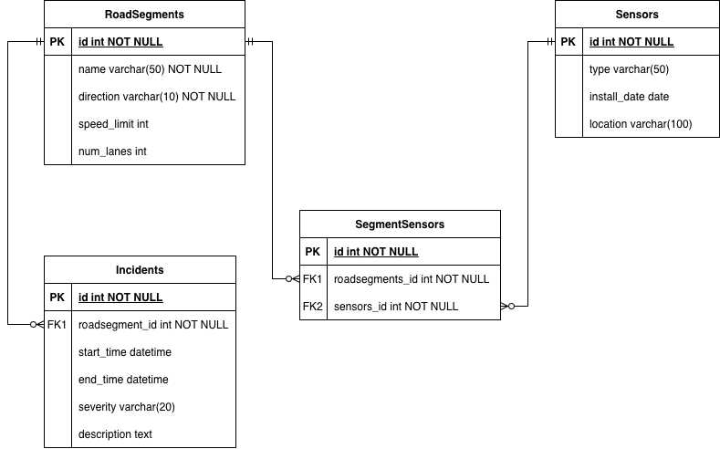

# ICA-Make-an-ERD
## Relationships:
-One RoadSegment can have many Incidents (1:N).
-One RoadSegment can be linked to many SegmentSensors records (1:N).
-One Sensor can be linked to many SegmentSensors records (1:N).
-Through SegmentSensors, RoadSegments and Sensors form a many-to-many relationship.

